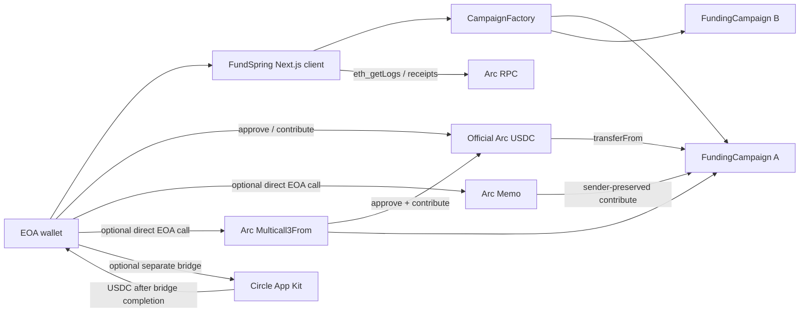

# FundSpring

**FundSpring — Built on Arc**

FundSpring is an independent all-or-nothing USDC crowdfunding application built
on Arc Network. Campaign creators set an immutable funding goal, deadline, and
beneficiary. Contributors escrow official USDC in a dedicated campaign contract.
After the deadline, anyone can finalize: a successful campaign lets the
beneficiary claim once; a failed or cancelled campaign lets each contributor
pull their own refund.

> Experimental Arc Testnet software. The contracts have not undergone a
> professional third-party security audit.

FundSpring is an independent application built on Arc Network. It is not an
official Arc or Circle product, and references to Arc describe the
infrastructure used by the application rather than an endorsement.

## Why FundSpring

Crowdfunding platforms often require users to trust a platform database,
custodial account, and discretionary refund process. FundSpring puts the
campaign economics and settlement rules in non-upgradeable contracts:

- one official funding asset: Arc Testnet USDC;
- fixed goal, deadline, and beneficiary;
- optional overfunding;
- permissionless finalization after the deadline;
- no platform fee or administrative custody;
- independent pull-based refunds with no unbounded payment loop.

## Network status

Official Arc documentation reviewed on 2026-07-25 states that Arc is currently
in its **testnet phase**. FundSpring targets only:

| Parameter | Verified value |
| --- | --- |
| Network | Arc Testnet |
| Chain ID | `5042002` |
| RPC | `https://rpc.testnet.arc.network` |
| Explorer | `https://testnet.arcscan.app` |
| Native gas token | USDC, 18-decimal gas accounting |
| USDC ERC-20 interface | `0x3600000000000000000000000000000000000000`, 6 decimals |
| Memo | `0x5294E9927c3306DcBaDb03fe70b92e01cCede505` |
| Multicall3From | `0x522fAf9A91c41c443c66765030741e4AaCe147D0` |

Native and ERC-20 USDC are two interfaces over the same underlying Arc balance.
FundSpring uses ERC-20 units for contributions and allowances, and 18-decimal
native units for gas estimates.

## Architecture



See [docs/architecture.md](docs/architecture.md) for the complete transaction
and event model.

## Main user flows

1. Connect an EOA wallet and switch to Arc Testnet.
2. Create a campaign through `CampaignFactory`.
3. Contribute through one of three clearly separated routes:
   - standard approve, then `contribute()`;
   - atomic `Multicall3From.aggregate3()` approve + contribute when allowance is
     insufficient;
   - `Memo.memo()` wrapping `contribute()` after allowance is available.
4. After the deadline, anyone calls `finalizeCampaign()`.
5. The beneficiary calls `claimFunds()` after success, or each contributor calls
   `claimRefund()` after failure/cancellation.

The Memo and Multicall3From flows are never nested. Both require a direct EOA
caller. FundSpring checks for contract code and falls back to the standard
two-transaction route. It does not claim that every wallet supports Arc
transaction extensions.

The optional App Kit panel bridges testnet USDC from Ethereum Sepolia, Base
Sepolia, or Arbitrum Sepolia to Arc Testnet. It waits for the bridge result,
switches back to Arc, and keeps the subsequent contribution as a separate user
action. Bridge and contribution are never described as atomic.

## Arc transaction memo format

`memoId` is deterministic:

```solidity
keccak256(abi.encode(campaignAddress, contributorAddress, contributionReference))
```

`memoData` is ABI encoded as:

```text
(string application, string action, address campaign, string reference)
("FUNSPRING", "CONTRIBUTION", <campaign>, <local reference>)
```

The frontend verifies `Memo.sender`, `Memo.target`, `Memo.memoId`, and
`Memo.callDataHash == keccak256(encoded contribute calldata)`. It correlates the
Memo, `ContributionReceived`, and ERC-20 `Transfer` by transaction hash and
shows the reference in the activity feed.

## Batched approve and contribute

When allowance is below the requested amount, the optional batch route calls
Arc's predeployed `Multicall3From.aggregate3` with:

1. `USDC.approve(campaignAddress, contributionAmount)`;
2. `FundingCampaign.contribute(contributionAmount)`.

Both `Call3.allowFailure` values are `false`. The final receipt must contain:

- an ERC-20 USDC `Transfer` from the original wallet to the campaign;
- `ContributionReceived` whose contributor is the original wallet.

If allowance is already sufficient, FundSpring calls `contribute()` directly.
Contract wallets and unavailable simulations use the standard fallback.

## Arc gas and finality

- Transaction gas is estimated through the configured Arc RPC.
- Fees are displayed in USDC using native 18-decimal precision.
- The wallet balance check covers the contribution plus estimated fee.
- The interface never asks for ETH.
- Transactions have only `submitted/unconfirmed` and `final` states.
- Success appears only after a successful receipt with one deterministic Arc
  confirmation; there is no generic multi-confirmation countdown.

## Event reconciliation

The campaign activity feed queries actual logs for:

- `CampaignCreated`;
- `ContributionReceived`;
- `CampaignFinalized`;
- `CampaignCancelled`;
- `FundsClaimed`;
- `RefundClaimed`;
- Arc `Memo`;
- relevant ERC-20 USDC `Transfer`.

Records use `(emitter address, transaction hash, log index)` as their stable
deduplication key. Related events are correlated by transaction hash. The
indexer reads only the ERC-20 USDC emitter for application transfers, so Arc's
parallel 18-decimal EIP-7708 system event cannot double-count a contribution.
Set `NEXT_PUBLIC_DEPLOYMENT_BLOCK` for complete history; otherwise the testnet
client deliberately limits queries to the latest 100,000 blocks.

## Repository layout

```text
contracts/       Project contracts, Arc interfaces, and local mocks
test/            Factory, campaign, fuzz, and edge-case tests
script/          Deployment and interaction scripts
app/             Next.js App Router pages
components/      Reusable wallet, campaign, transaction, and event UI
hooks/           Arc RPC query hooks
lib/             Verified network config, ABIs, formatters, metadata helpers
deployments/     Honest network deployment records
docs/            Architecture, lifecycle, security, deployment, and demo docs
metadata/        Example campaign metadata
```

## Local installation

Requirements:

- Node.js 20.9 or later;
- npm 10 or later;
- Foundry 1.7 or later.

```bash
git clone <repository-url>
cd fundspring
cp .env.example .env.local
npm install
forge install foundry-rs/forge-std --no-git
```

Keep the verified Arc values in `.env.local`. Leave
`NEXT_PUBLIC_CAMPAIGN_FACTORY_ADDRESS` empty until a real deployment exists.
Never commit `.env`, keys, seed phrases, or keystores.

## Contract testing

```bash
forge fmt --check
forge build
forge test
forge test -vvv
forge test --gas-report
```

Local Foundry runs validate campaign economics and standard EVM behavior.
Arc-specific Memo, CallFrom sender preservation, EIP-7708 logs, and
Multicall3From must additionally be exercised against Arc Testnet. See
[docs/arc-testnet-validation.md](docs/arc-testnet-validation.md).

## Frontend development

```bash
npm run dev
npm run lint
npm run typecheck
npm run test:frontend
npm run build
# or run the complete frontend gate:
npm run check
```

Open `http://localhost:3000`, or use the production deployment at
[fundspring.vercel.app](https://fundspring.vercel.app).

## Deployment

Use a Foundry encrypted keystore/account. Do not pass a private key as a
plain-text CLI argument:

```bash
forge script script/Deploy.s.sol:Deploy \
  --rpc-url "$ARC_RPC_URL" \
  --account "$FOUNDRY_ACCOUNT" \
  --broadcast
```

The current finalized addresses and transactions are recorded in
`deployments/arc-testnet.json`.

Verify with the Blockscout verifier used by Arc Testnet Explorer:

```bash
forge verify-contract "$CAMPAIGN_FACTORY_ADDRESS" \
  contracts/CampaignFactory.sol:CampaignFactory \
  --chain-id 5042002 \
  --verifier blockscout \
  --verifier-url https://testnet.arcscan.app/api/ \
  --constructor-args "$(cast abi-encode 'constructor(address)' \
  0x3600000000000000000000000000000000000000)"
```

Detailed commands are in [docs/deployment.md](docs/deployment.md).

## Project-Deployed Contracts

- `CampaignFactory` - factory and campaign registry at
  [`0xA21d...0cb8`](https://testnet.arcscan.app/address/0xA21d0D15C0851E04D560826Fa20EB787B9C30cb8).
  Deployed on Arc Testnet in
  [`0xa334...cca2`](https://testnet.arcscan.app/tx/0xa334cc5d8aa86f477036955fb23962c609dc391f289c03981c35bbf3fc9dcca2)
  with official USDC as its constructor parameter. User functions include
  `createCampaign`, paginated registry reads, and creator lookups.
- `FundingCampaign` - demo all-or-nothing campaign at
  [`0x2112...f5ab`](https://testnet.arcscan.app/address/0x2112eFE5f68F7f9d42596324230197890A29f5ab),
  created in
  [`0x350e...a045`](https://testnet.arcscan.app/tx/0x350e55d554aca5941c82e752ac88ca96ae65d74fa2b4b8c1fc2a3508ecfba045).
  User functions include `contribute`, `finalizeCampaign`, `claimFunds`,
  `claimRefund`, and read-only campaign state.

Constructor parameters and blocks are recorded in
[deployments/arc-testnet.json](deployments/arc-testnet.json). Source
verification is pending because Arc Testnet Explorer's Blockscout API returned
HTTP 503 on the verification request; no verified-source claim is made.

## External Arc and Circle Dependencies

These are shared infrastructure and are **not owned or deployed by FundSpring**:

- official Arc Testnet USDC ERC-20 interface;
- Arc Memo contract;
- Arc Multicall3From contract;
- Arc RPC and Arc Testnet Explorer;
- Circle Faucet for test funds;
- Circle App Kit and its Viem adapter for the optional, non-atomic testnet USDC
  wallet-funding flow.

## Security considerations

- OpenZeppelin `SafeERC20` and `ReentrancyGuard`;
- checks-effects-interactions;
- immutable economic parameters and dependencies;
- custom errors and explicit state transitions;
- one-time beneficiary claim;
- zero-before-transfer refund accounting;
- no proxy, delegatecall, platform withdrawal, fee, or admin custody;
- no unbounded contributor payment loop.
- runtime validation and a 64 KB limit for external campaign metadata;
- production CSP, anti-framing, MIME-sniffing, referrer, and permissions headers;
- GitHub Actions gates for frontend and contract checks;
- separate fee estimates for approval and contribution, with a post-approval
  Arc balance recheck.

Metadata remains mutable only before the first contribution and is not a trusted
source for campaign economics. See [SECURITY.md](SECURITY.md) and
[docs/security-model.md](docs/security-model.md).

## Known limitations

- Arc is testnet software and may be unstable.
- No professional audit has been completed.
- No centralized indexer: the dashboard performs reasonable testnet log/state
  queries and can become slow with a very large registry.
- `getCampaignsByCreator` returns a simple unbounded creator-specific array; the
  global registry provides pagination.
- HTTPS metadata availability and accuracy are the creator's responsibility;
  FundSpring validates its display schema but does not endorse its content.
- EOA detection is conservative and cannot guarantee every wallet integration
  supports transaction extensions.
- Exact Memo and Multicall3From behavior cannot be reproduced by local Anvil;
  the recorded Arc Testnet receipts are the validation source.
- Explorer source verification is pending after a Blockscout API HTTP 503.
- Official App Kit currently brings low/moderate transitive npm advisories; no
  high or critical production advisory was reported by the 2026-07-25 audit.

## Roadmap

- retry Blockscout source verification when the explorer API is available;
- add a production indexer after event volume justifies it;
- commission an independent smart-contract audit.

## Official documentation used

- [Arc documentation index](https://docs.arc.io/llms.txt)
- [Connect to Arc](https://docs.arc.io/arc/references/connect-to-arc)
- [Contract addresses](https://docs.arc.io/arc/references/contract-addresses)
- [EVM differences](https://docs.arc.io/build/evm-differences)
- [Gas and fees](https://docs.arc.io/arc/references/gas-and-fees)
- [Deterministic finality](https://docs.arc.io/arc/concepts/deterministic-finality)
- [Transaction memos](https://docs.arc.io/arc/concepts/transaction-memos)
- [Batched transactions](https://docs.arc.io/arc/concepts/batched-transactions)
- [USDC system events](https://docs.arc.io/arc/references/usdc-system-events)
- [Deploy on Arc](https://docs.arc.io/arc/tutorials/deploy-on-arc)
- [Monitor contract events](https://docs.arc.io/arc/tutorials/monitor-contract-events)
- [App Kit supported blockchains](https://docs.arc.io/app-kit/references/supported-blockchains)
- [Arc Brand Guidelines and Partner Toolkit](https://www.arc.io/brand-guidelines-and-partner-toolkit)

Arc is a trademark of Circle Internet Group, Inc. and/or its affiliates.
