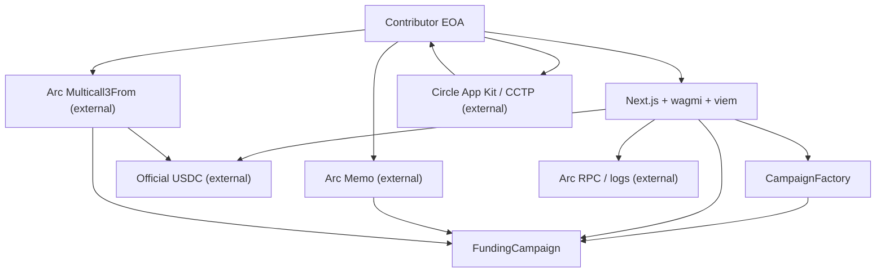

# Architecture

## Contract topology

`CampaignFactory` holds the immutable official USDC address, validates campaign
creation, deploys `FundingCampaign`, and maintains a global and per-creator
registry. Each `FundingCampaign` is a non-upgradeable escrow with immutable
creator, beneficiary, token, goal, and deadline.



## USDC movement

Contributions call `safeTransferFrom(contributor, campaign, amount)` after
accounting is updated. A successful beneficiary claim sends the full
`totalRaised` once. A refund zeroes only the caller's contribution before
transferring that amount. No loop pays contributors.

Arc native USDC gas accounting uses 18 decimals; the application-level ERC-20
interface uses 6. The frontend converts the contribution amount to equivalent
18-decimal native units before checking that the shared balance covers
contribution plus estimated gas.

## Transaction routes

- **Standard:** approve if needed, wait for a final receipt, then contribute.
- **Batch:** direct EOA calls `aggregate3` with approve and contribute; both
  subcalls use `allowFailure=false`.
- **Memo:** allowance is prepared separately; direct EOA calls `Memo.memo`
  wrapping only `FundingCampaign.contribute`.

Memo is never nested in Multicall3From. The optional App Kit bridge completes
before the wallet returns to Arc and does not submit a campaign contribution.

## Event indexing and reconciliation

The browser queries logs from `NEXT_PUBLIC_DEPLOYMENT_BLOCK`. Without it, the
fallback window is the latest 100,000 blocks. Stable record identity is:

```text
emitterAddress + transactionHash + logIndex
```

`ContributionReceived`, the 6-decimal USDC `Transfer`, and an optional `Memo`
are correlated by transaction hash. Memo identity also checks `memoId`,
`target`, `sender`, and `callDataHash`. The indexer does not mix Arc's
18-decimal system `Transfer` emitter with the ERC-20 emitter, preventing
double-counting.

The testnet dashboard queries every registered campaign to calculate
address-specific contributions. This is intentionally decentralized but does
not scale indefinitely. A production indexer can preserve the same canonical
event IDs.

## External dependencies

USDC, Memo, Multicall3From, App Kit/CCTP, RPC, explorer, and wallet providers
are external infrastructure. Only CampaignFactory and FundingCampaign
instances are project contracts.
