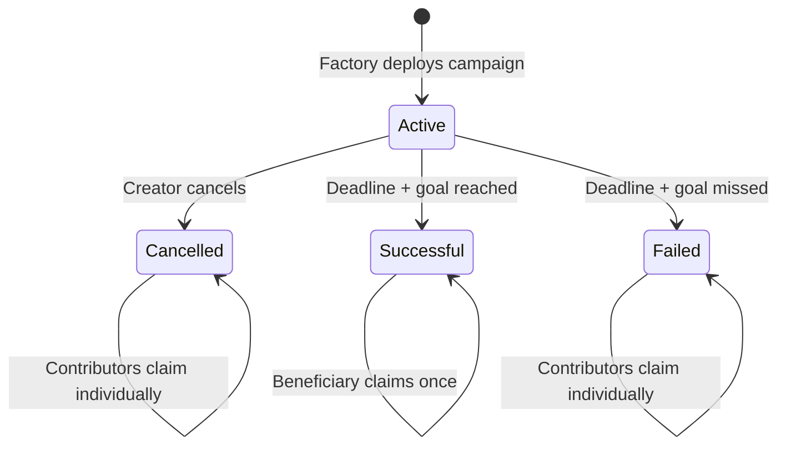

# Contract lifecycle

## Active

Contributions are accepted only before `deadline`. Overfunding is allowed. The
creator may update metadata only before the first contribution and may cancel
before finalization.

## Successful

After the deadline, anyone finalizes. If `totalRaised >= fundingGoal`, only the
beneficiary may claim the full amount, once.

## Failed

If the goal was missed, each contributor independently calls `claimRefund()`.

## Cancelled

Cancellation never pushes funds. It only enables each contributor's pull
refund.

